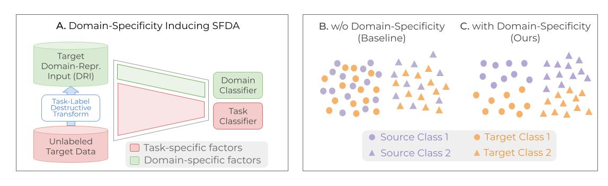

# Domain-Specificity-inducing Transformer for Source-Free Domain Adaptation

This repository contains the code for the paper [Domain-Specificity-inducing Transformer for Source-Free Domain Adaptation](http://arxiv.org/abs/2308.14023) by Sunandini Sanyal*, Ashish Ramayee Asokan*, Suvaansh Bhambri*, Akshay Kulkarni, Jogendra Nath Kundu, and R. Venkatesh Babu.

TLDR: We analyze Source-Free Domain Adaptation (SFDA) from the perspective of domain-specificity, and show that disentangling and learning the domain-specific and domain-invariant representations in a Vision Transformer (ViT) architecture can lead to improved adaptation.

### Abstract

Conventional Domain Adaptation (DA) methods aim to learn domain-invariant feature representations to improve the target adaptation performance. However, we motivate that domain-specificity is equally important since in-domain trained models hold crucial domain-specific properties that are beneficial for adaptation. Hence, we propose to build a framework that supports disentanglement and learning of domain-specific factors and task-specific factors in a unified model. Motivated by the success of vision transformers in several multi-modal vision problems, we find that queries could be leveraged to extract the domain-specific factors. Hence, we propose a novel Domain-Specificity inducing Transformer (DSiT) framework for disentangling and learning both domain-specific and task-specific factors. To achieve disentanglement, we propose to construct novel Domain-Representative Inputs (DRI) with domain-specific information to train a domain classifier with a novel domain token. We are the first to utilize vision transformers for domain adaptation in a privacy-oriented source-free setting, and our approach achieves state-of-the-art performance on single-source, multi-source, and multi-target benchmarks.

### Summary

<figure>
  
  <figcaption> <b>A.</b> Overview of the proposed framework. <b>B.</b> Conventional DA methods preserve domain-invariance, resulting in only task-oriented clusters in the feature space. <b>C.</b> Our proposed disentanglement ensures that different domains are well-clustered.
</figcaption>
</figure>

## Code

Coming Soon!
